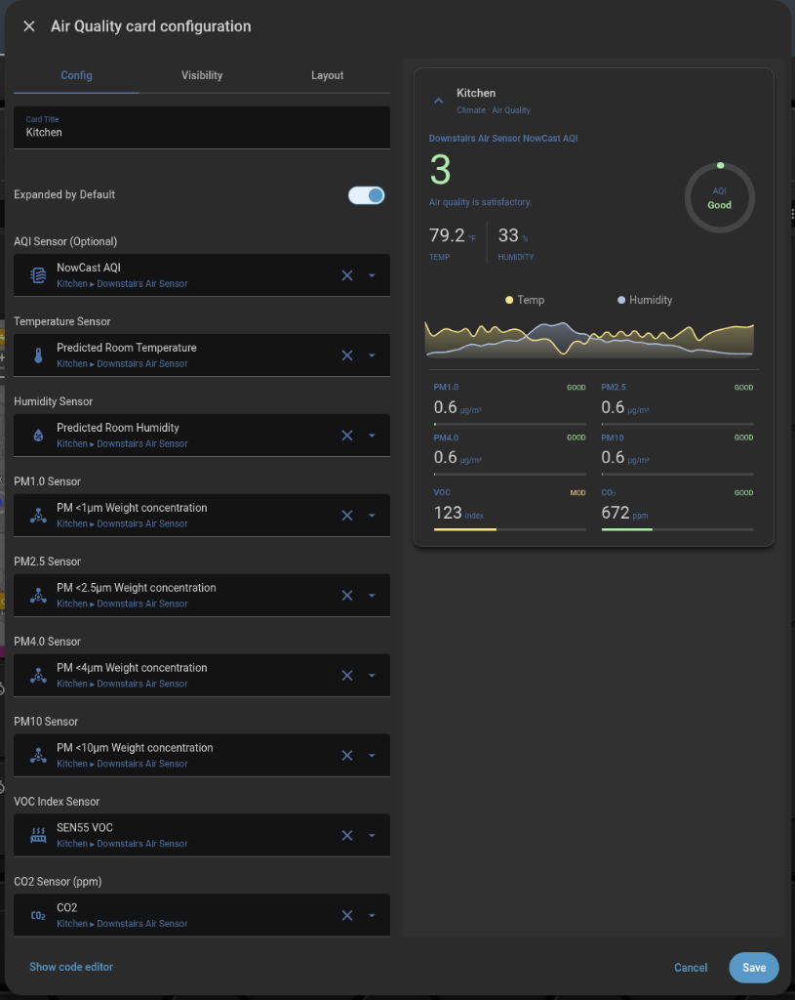

# Air Quality Card

A modern, highly customizable air quality card for Home Assistant with support for multiple pollutants, climate trends, and an interactive expand/collapse feature.

## Screenshots

### Expanded View


### Collapsed View


### Visual Configuration


## Requirements

This card optionally uses [mini-graph-card](https://github.com/kalkih/mini-graph-card) to display temperature and humidity trend graphs. **The card will function normally without it**, but the trend graphs will not be displayed.

## Installation

### HACS (Recommended)

1. Open HACS.
2. Click on "Frontend".
3. Click on the three dots in the top right corner and select "Custom repositories".
4. Add `https://github.com/firstof9/ha-air-quality-card` with category "Lovelace".
5. Search for "Air Quality Card" and click "Download".

### Manual

1. Download `air-quality-card.js` from the latest release.
2. Copy it to your `config/www/` directory.
3. Add the following to your `configuration.yaml` or through the UI:
   ```yaml
   resources:
     - url: /local/air-quality-card.js
       type: module
   ```

## Usage

```yaml
type: custom:air-quality-card
title: Living Room
aqi_entity: sensor.air_quality_index # Optional: If not provided, a score will be calculated from available pollutants
temp_entity: sensor.living_room_temperature
humid_entity: sensor.living_room_humidity
pm25_entity: sensor.living_room_pm2_5
pm10_entity: sensor.living_room_pm10
# Optional: pm1_entity, pm4_entity, voc_entity, co2_entity, default_expanded
```

## Theming

The card's band colors are exposed as CSS custom properties so you can override them in your HA theme YAML, in `card_mod`, or via any other CSS injection method.

Each band has two variants:

- **`-color`** is the bright tint used for the ring stroke, chip background, dot, and pollutant-tile bar fill. Defaults match Tailwind 200/300.
- **`-text`** is a darker variant used wherever the band color appears as foreground text (headline, chip label, ring-center label, tile threshold label). Defaults are Tailwind 600 — they hit ~4:1 contrast on light theme where the bright tints fail WCAG AA.

| Property | Default `-color` / `-text` | Used for |
|---|---|---|
| `--air-quality-card-good-{color,text}` | `#86efac` / `#16a34a` | "Good" band (AQI ≤ 50, score ≥ 80) |
| `--air-quality-card-moderate-{color,text}` | `#fde68a` / `#ca8a04` | "Moderate" band |
| `--air-quality-card-unhealthy-sg-{color,text}` | `#fdba74` / `#ea580c` | "Unhealthy for Sensitive Groups" / pollutant tile "HIGH" |
| `--air-quality-card-unhealthy-{color,text}` | `#fca5a5` / `#dc2626` | "Unhealthy" / pollutant tile "V.HIGH" |
| `--air-quality-card-very-unhealthy-{color,text}` | `#d8b4fe` / `#9333ea` | "V. Unhealthy" (AQI mode) |
| `--air-quality-card-hazardous-{color,text}` | `#fda4af` / `#e11d48` | "Hazardous" (AQI mode) |
| `--air-quality-card-poor-{color,text}` | `#fdba74` / `#ea580c` | "Poor" (score mode) |
| `--air-quality-card-bad-{color,text}` | `#fca5a5` / `#dc2626` | "Bad" (score mode) |
| `--air-quality-card-no-data-color` | `#9ca3af` | Empty-state ring + chip |

Example theme override:

```yaml
my_theme:
  air-quality-card-good-color: "#10b981"
  air-quality-card-good-text:  "#047857"
  air-quality-card-hazardous-color: "#7c2d12"
```
