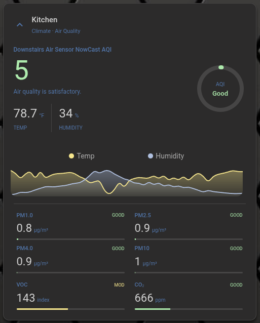
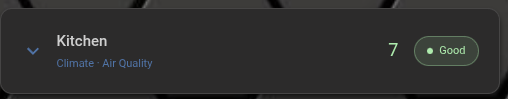

# Air Quality Card

A modern, highly customizable air quality card for Home Assistant with support for multiple pollutants, climate trends, and an interactive expand/collapse feature.

## Screenshots

### Expanded View


### Collapsed View


## Installation

### HACS (Recommended)

1. Open HACS.
2. Click on "Frontend".
3. Click on the three dots in the top right corner and select "Custom repositories".
4. Add `https://github.com/firstof9/ha-air-quality-card` with category "Lovelace".
5. Search for "Air Quality Card" and click "Download".

### Manual

1. Download `air-quality-card.js` from the latest release.
2. Copy it to your `config/www/` directory.
3. Add the following to your `configuration.yaml` or through the UI:
   ```yaml
   resources:
     - url: /local/air-quality-card.js
       type: module
   ```

## Usage

```yaml
type: custom:air-quality-card
entity: sensor.air_quality
```
